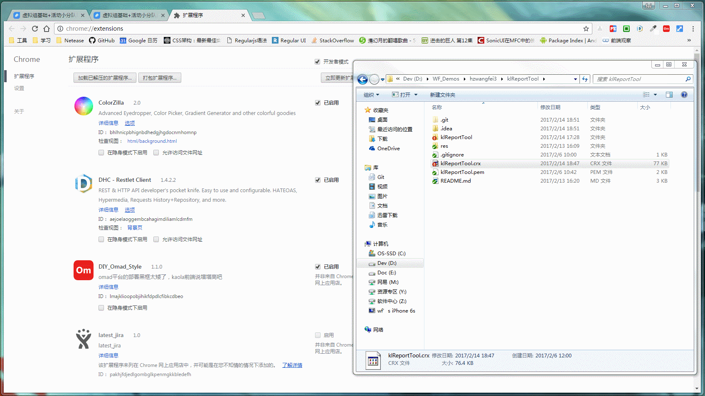

# klReportTool

- 日报生成器，chrome浏览器插件

- 配合云协作，用以帮助每日发日报的人一键收集每日报表（*.table文件）中的日报数据，并生成对应的markdown格式内容到剪切板，以便记录归档（*.md文件）

- 云协作地址：[http://note.youdao.com/group/#/12651257/folder/133390205](http://note.youdao.com/group/#/12651257/folder/133390205)

- 只生成小组日报，没有大组日报合并功能

### 安装

1. 下载chrome拓展插件 [klReportTool.crx](klReportTool.crx)，*pem文件不需要*

2. 打开谷歌浏览器，安装插件，地址栏 [chrome://extensions](chrome://extensions/)，直接将这个*.crx文件拖进去即可完成安装

### 使用

1. 入口一：浏览器右上角插件图标入口

2. 入口二：页面左下角蓝色圆形按钮“日报”

点击之后，一键根据表格中的内容生成对应的markdown格式的内容，并自复制到剪切板，此时新建一个*.md文件直接ctrl+v粘贴即可

### 动态示意图

