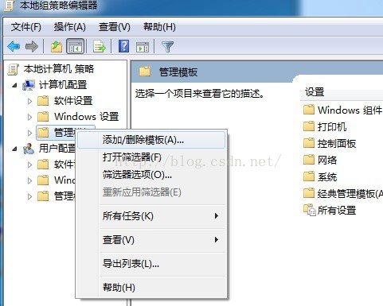
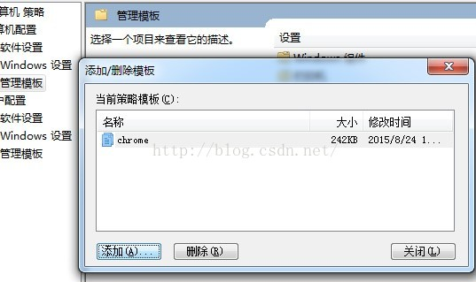
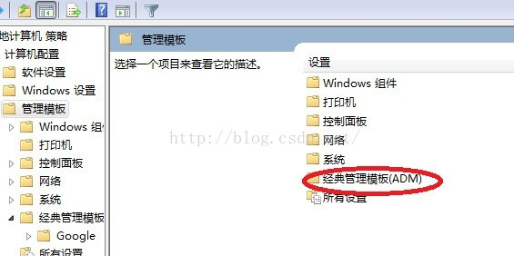
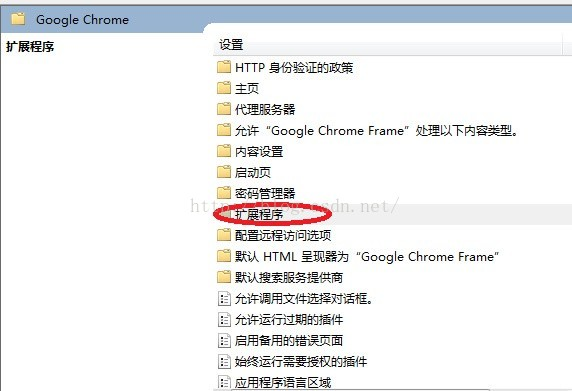
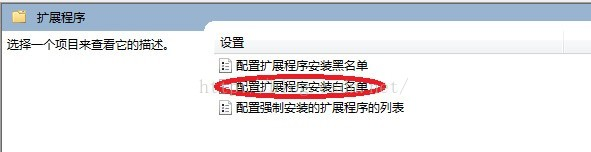
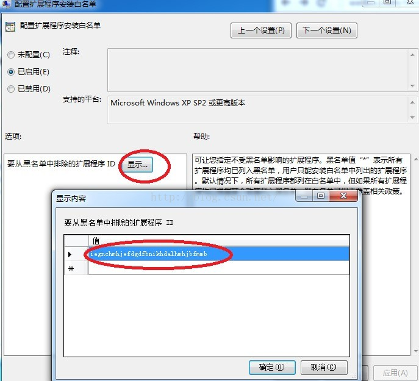
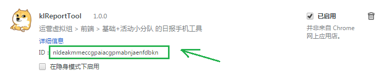

# chrome插件开发入门讲解

chrome作为目前最流行的浏览器，备受前端推崇，原因除了其对于前端标准的支持这一大核心原因之外，还有就是其强大的扩展性，
基于其开发规范实现的插件如今已经非常庞大，在国内也是欣欣向荣，
如天猫开发了大量的扩展，用于检测页面质量以及页面性能，淘宝开发了许多的扩展以供运营工具的优化等等。其强大性不言而喻。

这里我们来讲一下其插件开发

## 基础概念

1. 与chrome应用类似，chrome扩展主要是用于扩充chrome浏览器的功能。他体现为一些文件的集合，包括前端文件（html/css/js）,配置文件manifest.json。
主要采用JavaScript语言进行编写。

> 个别扩展可能会用到DLL和so动态库，不过处于安全性考虑，在后续的标准中，将会被舍弃，这里不再赘述

2. chrome扩展能做的事情：

- 基于浏览器本身窗口的交互界面
- 操作用户页面：操作用户页面里的dom
- 管理浏览器：书签，cookie，历史，扩展和应用本身的管理
- 网络通信：http，socket，UDP/TCP等
- 跨域请求不受限制：
- 常驻后台运行
- 数据存储：采用3种方式（localStorage，Web SQL DB，chrome提供的存储API（文件系统））
- 扩展页面间可进行通信：提供runtime相关接口
- 其他功能：下载，代理，系统信息，媒体库，硬件相关（如usb设备操作，串口通信等），国际化

3. chrome扩展的限制：

- chrome扩展的脚本，可以获取并操作页面dom，但是，出于安全性的考虑，页面脚本的域是独立区分开来的，即js成员变量不共享。

&nbsp; &nbsp;
&nbsp; &nbsp;
&nbsp; &nbsp;
&nbsp; &nbsp;

## 如何添“加浏览器扩展白名单”

没有在Chrome应用商店web store上架发布的插件，如果没有添加到白名单里，下一次重启Chrome就会被禁用，而且无法手动启用，除非删掉重新添加。
可以通过添加白名单可以一劳永逸地解决这个问题。

### Mac下

mac系统下设置白名单比较简单，下载[com.google.Chrome.mobileconfig](res/mac-install-chrome-extension-whitelist/com.google.Chrome.mobileconfig)，后，双击安装即可（过程中可能会要求输入系统管理员密码）

> 当然，为适配本插件，该文件内容已经更改，有兴趣的同学请参见[res/mac-install-chrome-extension-whitelist/用法.md](res/mac-install-chrome-extension-whitelist/用法.md)，里面有详细说明如何将自定义开发的chrome插件添加到白名单的办法。

### windows下

1.Win+R、或者打开运行 输入 gpedit.msc

2.本地计算机策略 > 计算机配置 > 管理模板，右键管理模板，选择添加/删除模板。

&nbsp; &nbsp;

3.点击添加，将下载的chrome.adm（下载地址：[res/chrome.adm](res/chrome.adm)）添加进来。

&nbsp; &nbsp;

4.添加模板完成后，找到经典管理模板（ADM），点击进入，选择Google > Google Chrome

&nbsp; &nbsp;

5.打开后如下图所示，选择扩展程序，点击进入，配置扩展程序安装白名单

 &nbsp; 

&nbsp; &nbsp;

6.点击下图中的显示按钮，将我们安装插件后的ID添加到那个值列表中，点击确定返回即可。比如我们的是 **nldeakmmeccgpaiacgpmabnjaenfdbkn**

id信息如下：打开chrome的插件管理界面（地址栏 [chrome://extensions](chrome://extensions/)），找到这个插件

> 这里需要提一点，如果未开启开发者模式，可能会看不到这个id

&nbsp; &nbsp;